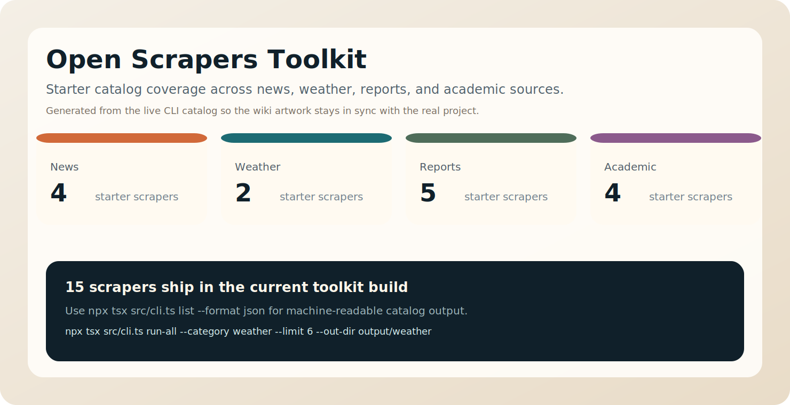
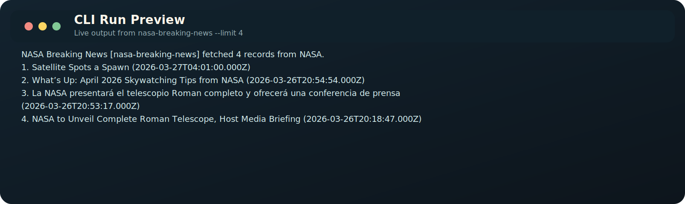

# Open Scrapers Toolkit Wiki

Open Scrapers Toolkit is the reusable backend of the Open Scrapers ecosystem. It is an open-source TypeScript project for collecting structured data from public news feeds, weather services, reports APIs, and academic indexes.

This wiki is the long-form guide for contributors, maintainers, and power users. The README is the fast entry point. These pages explain the real workflow, the project rules, and the conventions that keep the toolkit sustainable as the scraper catalog grows.



## Who this repository is for

- Developers who want to run a scraper from the command line.
- Contributors who want to add new data sources.
- Teams who want a structured starting point instead of a folder full of one-off scripts.
- Desktop-app users who want to understand the backend that powers Open Scrapers Desk.

## Repository role inside the ecosystem

The Open Scrapers project is intentionally split into two public repositories:

- `open-scrapers-toolkit`: the scraper engine, CLI, shared factories, and source catalog.
- `open-scrapers-desk`: the PyQt desktop application that calls this toolkit and presents saved JSON outputs in a readable interface.

That separation matters. Developers can use the toolkit directly in code or automation without inheriting a GUI dependency, while non-programmers can still use the same backend through the desktop app.

## Start here

- [Installation and Quick Start](Installation-and-Quick-Start.md)
- [CLI Reference](CLI-Reference.md)
- [Scraper Catalog](Scraper-Catalog.md)
- [Architecture](Architecture.md)
- [Adding a Scraper](Adding-a-Scraper.md)
- [Policies and Responsible Use](Policies-and-Responsible-Use.md)
- [Contribution and Release Process](Contribution-and-Release-Process.md)
- [Troubleshooting](Troubleshooting.md)
- [FAQ](FAQ.md)

## What the toolkit ships today

The starter catalog currently includes scrapers across four categories:

- `news`
- `weather`
- `reports`
- `academic`

The catalog is intentionally based on public APIs and public RSS feeds before more brittle source types. That keeps the first version easy to learn, lawful to review, and safer to extend.

## Core design goals

1. Keep the output structure predictable so downstream tools can consume results without source-specific parsers.
2. Prefer official APIs, RSS feeds, and public datasets over fragile browser automation.
3. Make new scrapers feel routine to add instead of requiring a rewrite every time.
4. Establish project rules early so the repository can scale without becoming a legal or maintenance mess.

## Typical workflows

### Run one scraper

```powershell
npx tsx src/cli.ts run bbc-world-news --limit 5 --output output/bbc-world-news.json
```

### Run one category

```powershell
npx tsx src/cli.ts run-all --category weather --limit 6 --out-dir output/weather
```

### Inspect the catalog as JSON

```powershell
npx tsx src/cli.ts list --format json
```

That JSON catalog is what the desktop app consumes when it loads the available scraper list.



## Visual assets

The toolkit wiki visuals are generated from the live project state so they can be refreshed when the catalog or CLI output changes:

```powershell
node scripts\generate_wiki_visuals.mjs
```

## Project boundaries

This repository is open source, but it is not a dumping ground for any possible scraper.

What belongs here:

- public feeds
- public APIs
- structured data endpoints
- documented, reviewable collection logic
- sources that can be normalized into stable JSON output

What does not belong here:

- paywall bypass tools
- login or CAPTCHA circumvention
- stealth scraping practices
- invasive collection of personal data
- undocumented modules that nobody else can safely maintain

## Related documentation in the repository

If you prefer docs that live alongside the source tree, the repo also includes:

- `docs/getting-started.md`
- `docs/architecture.md`
- `docs/scraper-catalog.md`
- `docs/adding-a-scraper.md`
- `docs/compliance.md`
- `docs/roadmap.md`

The wiki reorganizes that material into a more complete contributor guide.
